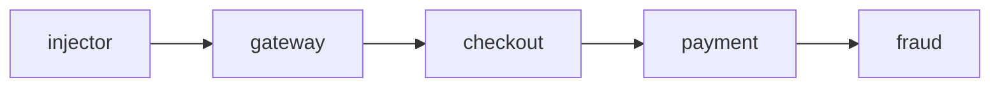

# observability-demo

A small distributed system, built to be instrumented. Four Go services and a load
injector, wired with the OpenTelemetry Go SDK so every request produces traces,
metrics, and logs. Companion to Part 2 of my observability series.



The code is Go because that is what I use day to day. The concepts are the same in
any language; only the SDK function names change.

## Run

Needs Docker or Podman:

```sh
docker compose up --build      # or: podman compose up --build
```

All five services plus an OpenTelemetry Collector start, and the injector begins
firing a request every 500ms.

## See it

There is no dashboard yet (that is Part 3). The collector prints everything it
receives to its own logs:

```sh
docker compose logs -f otel-collector
```

`payment` runs with `CHAOS_ERROR_RATE=0.2`, so about one request in five fails all
the way up the chain while the rest stay clean. Each service also logs JSON to
stdout, with the `trace_id` on every line.

## Backends (Part 3)

The base setup prints telemetry to the collector's logs. To send it to a real
backend instead, only the collector's exporter changes; the services do not.

```sh
# Grafana LGTM (bundled image, Grafana at http://localhost:3000)
docker compose -f compose.yaml -f compose.lgtm.yaml up --build

# SigNoz (run SigNoz separately first, then point the demo at it)
docker compose -f compose.yaml -f compose.signoz.yaml up --build
```

## Chaos knobs

Set per service in `compose.yaml`. All default to off.

| Env | Effect |
|-----|--------|
| `CHAOS_ERROR_RATE` | Fail this fraction of requests, `0.0`..`1.0` |
| `CHAOS_ERROR_STATUS` | Status returned on an injected error (default `500`) |
| `CHAOS_LATENCY` | Delay added before handling, e.g. `300ms` |
| `INJECT_INTERVAL` | How often the injector fires (default `500ms`) |

## Layout

```
cmd/                  service entry points
internal/             otelinit, chaos, httpx, logx, service
otel-collector.yaml   Part 3 swaps the exporter here
```

MIT.
